# Maternal and Child Health Monitoring System
## Software Documentation

**A Web-Based Maternal and Child Health Monitoring System with Patient-Accessible Records and SMS Notifications for Barangay Bicao Health Center, Carmen, Bohol**

---

## Table of Contents

1. [Software Requirements Specification](#1-software-requirements-specification)
   - 1.1 [Product Scope](#11-product-scope)
   - 1.2 [Data Collection and Analysis Process](#12-data-collection-and-analysis-process)
   - 1.3 [Functional Requirements](#13-functional-requirements)
   - 1.4 [Non-Functional Requirements](#14-non-functional-requirements)
2. [Process Modeling](#2-process-modeling)
   - 2.1 [Current (Manual) Process](#21-current-manual-process)
   - 2.2 [Proposed (Automated) Process](#22-proposed-automated-process)
3. [Project Design](#3-project-design)
   - 3.1 [Laravel and the MVC Architecture](#31-laravel-and-the-mvc-architecture)
   - 3.2 [Frameworks and APIs](#32-frameworks-and-apis)
   - 3.3 [Offline/Online Architecture](#33-offlineonline-architecture)
4. [Use Case Diagrams](#4-use-case-diagrams)
   - 4.1 [Account Authorization and Authentication](#41-account-authorization-and-authentication)
   - 4.2 [Patient Registration Management](#42-patient-registration-management)
   - 4.3 [Maternal Health Monitoring](#43-maternal-health-monitoring)
   - 4.4 [Child Health Monitoring](#44-child-health-monitoring)
   - 4.5 [SMS Notifications Management](#45-sms-notifications-management)
   - 4.6 [Online Messaging](#46-online-messaging)
   - 4.7 [Generate Reports](#47-generate-reports)
5. [Entity Relationship Diagram](#5-entity-relationship-diagram)
6. [Activity Diagrams](#6-activity-diagrams)
   - 6.1 [Register & Create New User](#61-register--create-new-user)
   - 6.2 [Login and Logout](#62-login-and-logout)
   - 6.3 [Patient Registration Process](#63-patient-registration-process)
   - 6.4 [Maternal Checkup Process](#64-maternal-checkup-process)
   - 6.5 [Immunization Management Process](#65-immunization-management-process)
   - 6.6 [SMS Notification Process](#66-sms-notification-process)
7. [Application Prototype](#7-application-prototype)
   - 7.1 [Login Page](#71-login-page)
   - 7.2 [Admin Dashboard Page](#72-admin-dashboard-page)
   - 7.3 [Patient Records Table Page](#73-patient-records-table-page)
   - 7.4 [Patient Registration Form](#74-patient-registration-form)
   - 7.5 [Maternal Health Monitoring Page](#75-maternal-health-monitoring-page)
   - 7.6 [Immunization Tracking Page](#76-immunization-tracking-page)
   - 7.7 [Growth Monitoring Page](#77-growth-monitoring-page)
   - 7.8 [SMS Management Page](#78-sms-management-page)
   - 7.9 [Messaging Page](#79-messaging-page)
   - 7.10 [Reports Page](#710-reports-page)
   - 7.11 [Patient Portal Page](#711-patient-portal-page)
   - 7.12 [Admin User Management Page](#712-admin-user-management-page)
8. [Technology Stack Summary](#8-technology-stack-summary)
9. [Deployment and Infrastructure](#9-deployment-and-infrastructure)

---

## 1. Software Requirements Specification

### 1.1 Product Scope

The objective of this project is to develop a web-based Maternal and Child Health Monitoring System for Barangay Bicao Health Center, Carmen, Bohol. The project is focused on providing solutions for the following processes: **Digital Patient Records**, **Maternal Health Monitoring**, **Child Health Monitoring (Immunization & Growth)**, **Appointment Scheduling**, **Automated SMS Notifications**, **Online Patient Messaging**, and **Reports Generation**.

This project also involved the different stakeholders for the Barangay Health Center which includes the **Health Center Administrator (Admin)**, **Midwives and Healthcare Workers (Staff)**, **Pregnant Women**, **Mothers and Guardians**, and **Barangay Health Staff**.

The project was developed using a local development environment with XAMPP/Laragon for Apache, MySQL, and PHP services. After the development, testing was done to ensure that the system meets the user's expectations. To determine the respondents for the testing, the researchers used non-probability sampling methods, specifically: purposive sampling and convenience sampling. In purposive sampling, respondents are selected since they already have the characteristics the researchers need for a sample. The identified respondent are the Health Center Administrators, Midwives, and Patient Representatives (Mothers/Guardians), which possess the necessary knowledge and can provide insights relevant to the system. In convenience sampling, respondents were selected because they were the easiest for the researchers to access.

For the healthcare workers, the researchers chose to test the faculty and staff of the health center. For the patient users, the researchers sent an invitation to test the system through orientation sessions prior to the testing. The respondents that responded through the orientation were prioritized.

Usability testing was performed for the testing. The survey tool developed using standard usability assessment frameworks was used to measure the usability of the system, which is composed of 20 statements that let the user rate each from Strongly Disagree to Strongly Agree. The researchers used the System Usability Scale, a reliable tool for measuring the usability of various products and services including hardware, software, mobile devices, websites, and applications.

Both the Health Center Staff and Patient Users willingly participated in the test. For the healthcare workers, there were a total of seven (7) testers. For the patient users, ten (10) individuals participated in the test, with a total of seventeen (17) respondents.

The software testing was done personally. The researchers used a functionality test to ensure that the system functionalities work for a specific user. During testing, the researchers gathered feedback from the responses for improvements to be made to the system.

The seventeen (17) responses were analyzed using descriptive statistics. The graphs generated by Google Forms were used for the summary.

### 1.2 Data Collection and Analysis Process

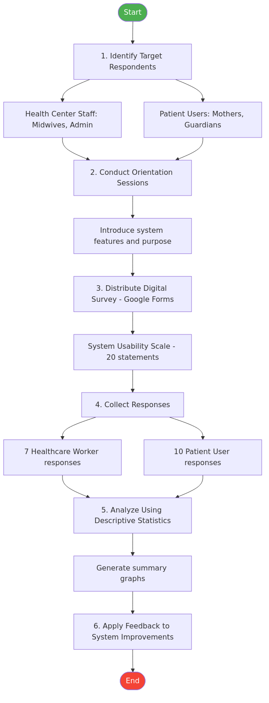

The use of digital forms in collecting survey responses was done to minimize the cost of using pen and paper and streamline the analysis of the collected data. The results of the Usability Test were used to develop the application further.

### 1.3 Functional Requirements

The software was divided into the following main functionalities:

| # | Functional Module | Description |
|---|---|---|
| 1 | **Manage Accounts** | Management of user accounts in the software. This includes registering / adding of new accounts, updating account information, and disabling of accounts. |
| 2 | **Manage Patient Records** | Management of patient profiles and health records. This includes adding, updating, and searching patient records with filtering by type and status. |
| 3 | **Manage Maternal Health** | Monitoring and recording of maternal health checkups. This includes prenatal visit logging with vitals (weight, blood pressure, fetal heart rate), gestational age tracking, and expected delivery date calculation. |
| 4 | **Manage Child Health** | Monitoring of child immunization schedules and growth measurements. This includes automatic generation of the Philippine EPI immunization schedule based on birth date, vaccine dose administration tracking, and growth chart recording. |
| 5 | **Manage SMS Notifications** | Management of SMS messages sent to patients. This includes manual SMS sending to individual patients, SMS gateway configuration, and connection status testing. |
| 6 | **Manage Online Messaging** | Real-time chat between healthcare workers and patients. This allows users to send text messages with file attachments, with read receipt indicators and real-time updates via WebSockets. |
| 7 | **Generate Reports** | Provides users with dashboard analytics and reports. This includes patient registration trends, submission by type (Maternal/Child), immunization compliance rates, and monthly breakdowns. |

#### Functional Requirements Detail

**Manage Accounts** involves the management of user accounts in the software. This includes registering / adding of new accounts, updating account information, and disabling of accounts. Only the admin can register accounts for Staff and Patient users. All actors can manage their own accounts. They can update their account information as well as update their passwords. The admin can also disable an account.

**Manage Patient Records** involves the management of patient records submitted to the system. This includes adding, updating, and viewing patient profiles. The staff enters the necessary patient information into the system. The staff can also update the patient information. Upon registration, the system automatically creates associated health records (Maternal Record or Child Record with immunization schedule) based on the registration type.

**Manage Maternal Health** involves monitoring prenatal care for pregnant women. Healthcare workers log checkup visits including weight, blood pressure, age of gestation, fetal heart rate, and clinical notes. The system tracks visit history chronologically and calculates the Expected Delivery Date (EDD) from the Last Menstrual Period (LMP). Patients can view their own maternal records through the Patient Portal.

**Manage Child Health** involves the tracking of immunization schedules and growth measurements. Upon child registration, the system automatically generates the standard Philippine EPI (Expanded Program on Immunization) schedule with correct dates based on the child's date of birth. Healthcare workers mark vaccine doses as administered. Growth measurements (weight, height) are logged periodically with age-in-months calculation. Patients can view immunization and growth records for their children through the Patient Portal.

**Manage SMS Notifications** involves the sending of SMS notifications to patients using a local Android SMS gateway. The admin configures the SMS gateway settings (URL, username, password) through the web interface. The system supports manual SMS sending to individual patients. The gateway connection status can be tested dynamically. All sent messages are logged with delivery status.

**Manage Online Messaging** provides real-time communication between healthcare workers and patients. Admin users see a list of patient users and can chat with any patient. Patient users communicate directly with the assigned healthcare worker (midwife). Messages support file attachments (up to 20MB). The system provides read receipts and real-time message delivery via Laravel Reverb WebSockets.

**Generate Reports** provides the admin with a dashboard where the actor can see reports for the system. The reports include total patients by registration type, monthly registration trends, and immunization compliance rates, which can be filtered by timeframe. The actor is also provided with the count of key performance indicators on each status.

### 1.4 Non-Functional Requirements

The system provides various non-functional capabilities for users to have a great user experience:

| # | Requirement | Description |
|---|---|---|
| 1 | **Portability and Compatibility** | The system is tested and can be used in multiple browsers. This ensures that whatever browser the user prefers, they can still be able to use the system. |
| 2 | **Responsiveness** | It also provides a responsive design that adjusts the user interface depending on the screen size of the user. |
| 3 | **Data Integrity** | This ensures that data entered in the various forms in the system are validated to avoid erroneous data in the database. New users, specifically patients, are required to provide verified contact information to ensure that the users stored in the database are also validated. |
| 4 | **Usability** | The system follows conventional User Experience patterns to ensure that users can use the system with little to no help from a technical individual. |
| 5 | **Security** | To ensure that the system is secured, passwords are encrypted (bcrypt hashed) so that it cannot be accessed directly in case of a database breach. The system also uses Laravel's built-in authentication feature which ensures that users that login to the system are verified and has access rights to the resource that it is accessing into. |
| 6 | **Offline Capability** | The system implements a Progressive Web App (PWA) architecture with Service Worker caching, IndexedDB for local data storage, and Background Sync for automatic data synchronization when connectivity is restored. This ensures healthcare workers can continue entering and viewing patient data in the field. |

---

## 2. Process Modeling

Business Process Model and Notation (BPMN) is utilized to visually represent the step-by-step business operations of the Barangay Bicao Health Center Maternal and Child Health monitoring workflow. For an Information Systems perspective, analyzing the workflow is crucial to identifying operational bottlenecks. This approach provides a clear graphical view of the end-to-end flow of the patient record management and health monitoring process, highlighting the efficiency gains introduced by the proposed automated system compared to the manual counterpart.

### 2.1 Current (Manual) Process

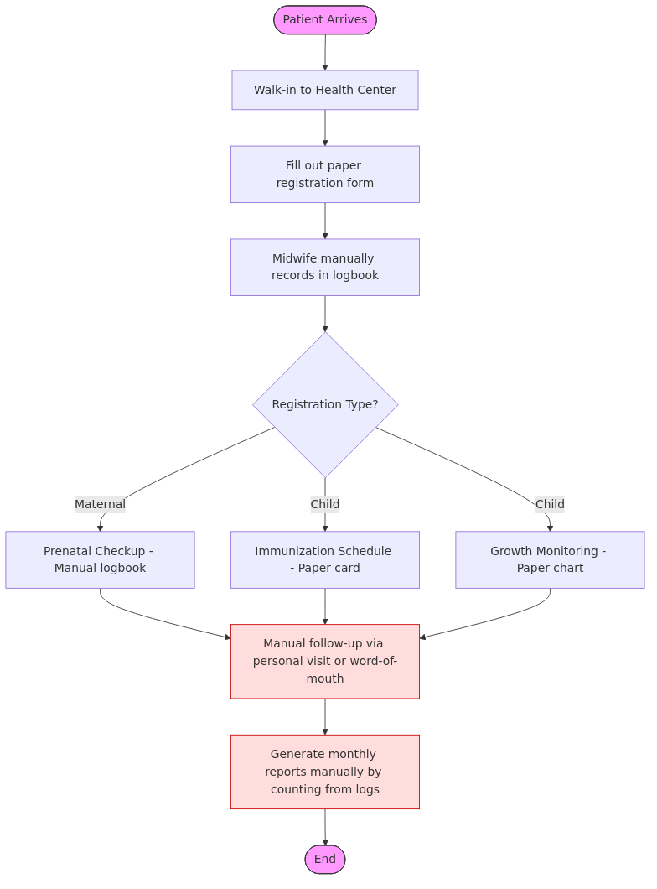

### 2.2 Proposed (Automated) Process

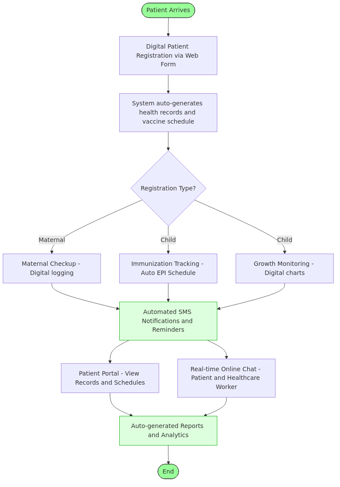

---

## 3. Project Design

This section shows the various architecture and technologies used in the development of the system.

### 3.1 Laravel and the MVC Architecture

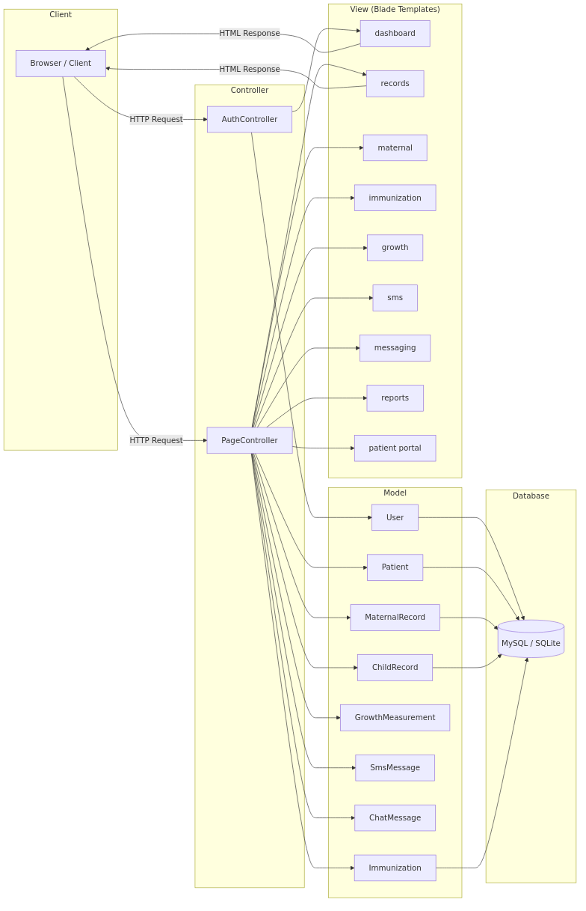

The system was developed using **Laravel 13.x**...

### 3.2 Frameworks and APIs

The system was created using various Frameworks and APIs:

| Technology | Purpose | Description |
|---|---|---|
| **Laravel 13.x** | Backend Framework | PHP framework for standardized web application development with built-in authentication, routing, ORM, and queue management. |
| **Blade** | Templating Engine | Laravel's built-in templating engine for rendering dynamic HTML views with template inheritance and component support. |
| **Tailwind CSS v4** | CSS Framework | A CSS framework that uses utility classes to generate styles and write them on a static CSS file, used to develop the front end. |
| **Vite** | Asset Bundler | Modern frontend build tool for fast development with Hot Module Replacement (HMR) and optimized production builds. |
| **Chart.js** | Charting Library | A charting library used for the generation of charts and reports on the dashboard and reports pages. |
| **Eloquent ORM** | Database ORM | Laravel's built-in object-relational mapper, used to interact with the database using an expressive, fluent syntax. |
| **Dompdf** | PDF Generator | An HTML-to-PDF converter, used to generate printable PDF reports and documents from system data. |
| **Vonage** | SMS Gateway API | A flexible communications platform, used to send SMS notifications to users using the Android SMS Gateway's Communications API. |
| **Laravel Reverb** | WebSocket Server | Laravel's first-party WebSocket server for real-time features, used for the online messaging module's live chat functionality. |
| **MySQL** | Database | The primary relational database management system for production deployments. |
| **Docker Compose** | Development Environment | Container orchestration tool for running the system (Nginx + PHP-FPM + MySQL + phpMyAdmin) consistently across environments. |
| **Paragon** | Development IDE | Used for the development environment for the system, which works well with Laravel and MySQL. |

### 3.3 Offline/Online Architecture

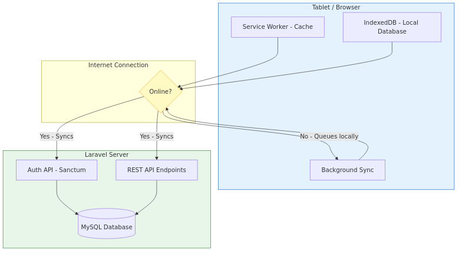

The system is designed to work reliably in areas with intermittent internet connectivity...

| Component | Role | Offline Behavior |
|---|---|---|
| **Service Worker** | Caches app shell (CSS, JS, icons, fonts) and previously visited pages | App loads instantly even without network |
| **IndexedDB** | Stores patient records, appointments, immunization data locally on the device | Full CRUD operations on cached data |
| **Background Sync** | Queues mutations (create/edit patient) made offline and replays them when connectivity returns | Changes sync automatically when online |
| **Sync API** | Laravel endpoints for bidirectional data sync with conflict resolution | Last-write-wins strategy |

| State | Behavior |
|---|---|
| **Online** | App fetches data from server, caches locally, and works at full speed |
| **Offline** | App serves cached pages; data reads come from IndexedDB; writes are queued locally |
| **Reconnecting** | Background Sync replays queued mutations; new server data is pulled and cached |

---

## 4. Use Case Diagrams

The system currently has four (4) user roles — namely **Admin**, **Staff**, **Midwife/Healthcare Worker**, and **Patient (Mother/Guardian)**.

The following sections will show the use case diagrams that depict how these users interact with the system during a specific functionality or scenario.

### 4.1 Account Authorization and Authentication

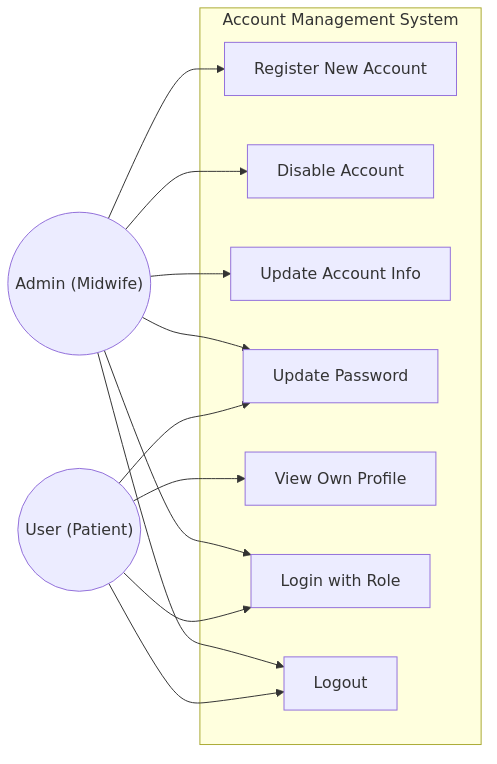

### 4.2 Patient Registration Management

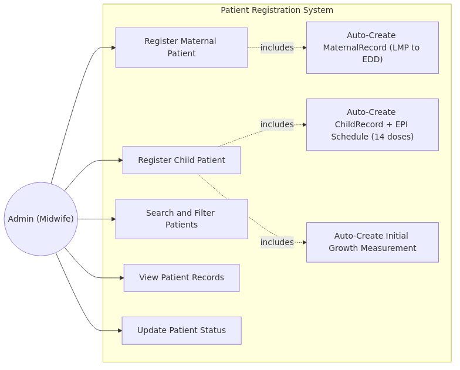

### 4.3 Maternal Health Monitoring

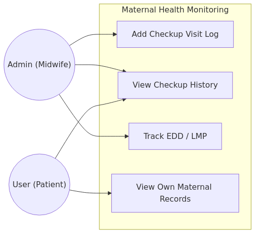

### 4.4 Child Health Monitoring

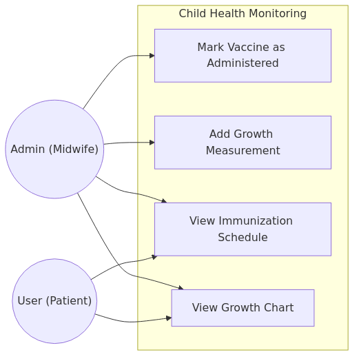

### 4.5 SMS Notifications Management

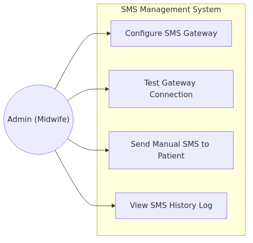

### 4.6 Online Messaging

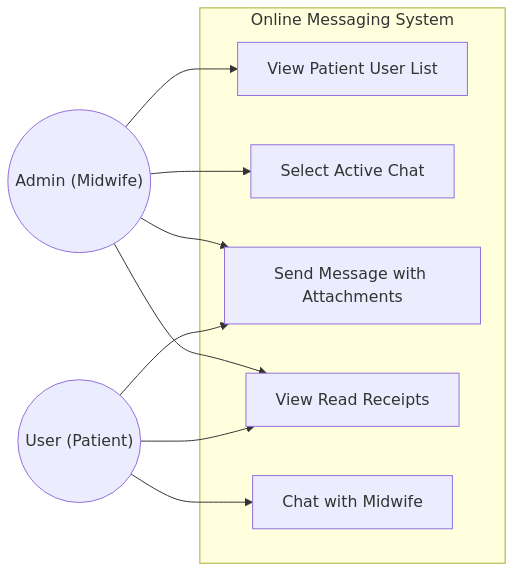

### 4.7 Generate Reports

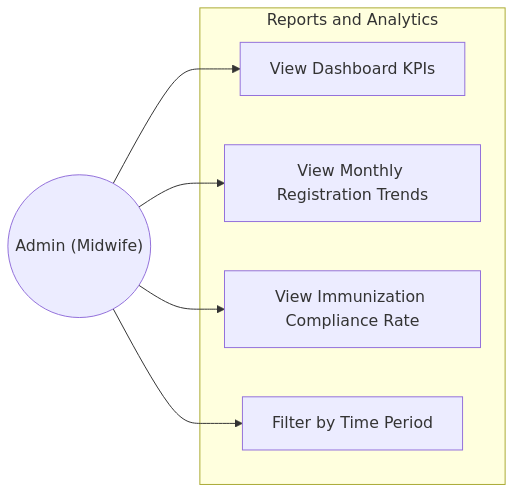

---

## 5. Entity Relationship Diagram

The Entity Relationship Diagram shows the relationship, cardinalities, associations, and data types of the entities used by the system.

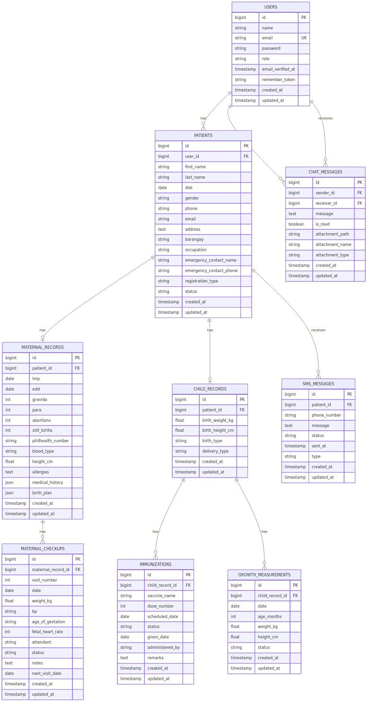

---

## 6. Activity Diagrams

The system currently has four (4) user roles — namely Admin, Staff, Midwife/Healthcare Worker, and Patient (Mother/Guardian).

The following figures will show the activity diagrams that depict how these users interact with the system during a specific functionality or scenario.

### 6.1 Register & Create New User

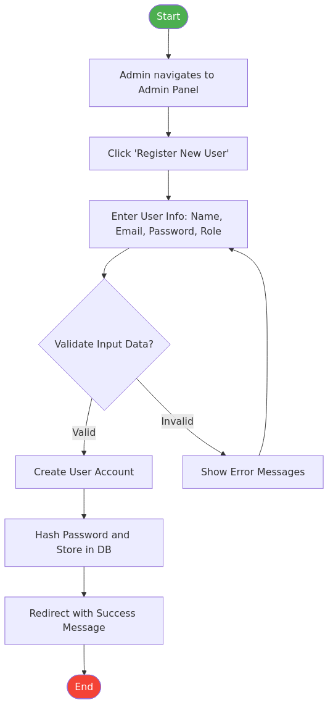

### 6.2 Login and Logout

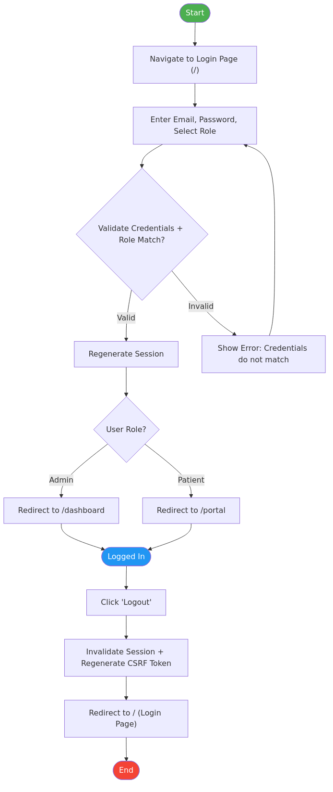

### 6.3 Patient Registration Process

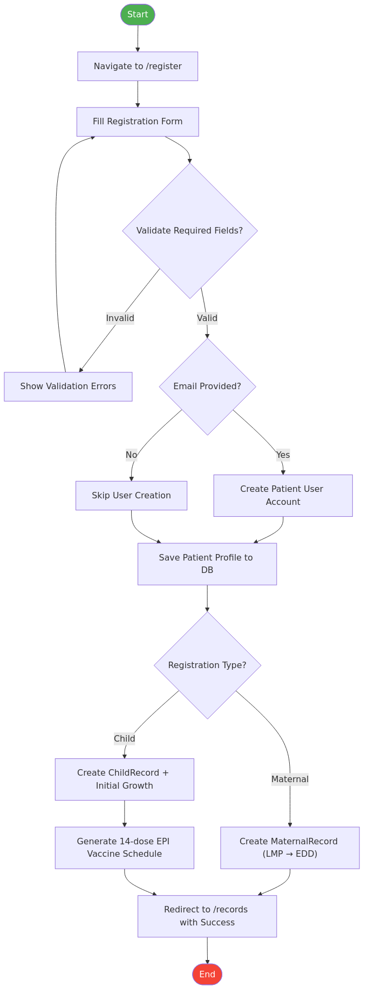

### 6.4 Maternal Checkup Process

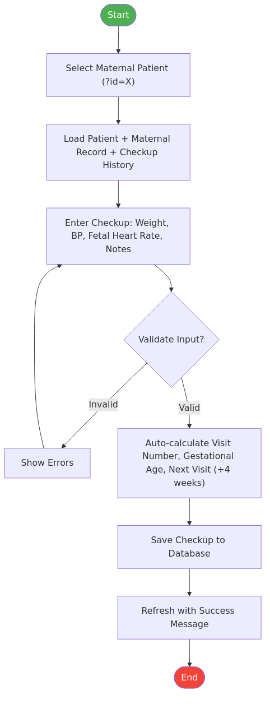

### 6.5 Immunization Management Process

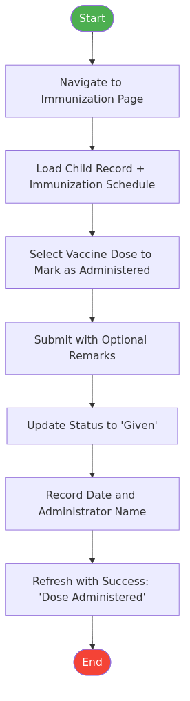

### 6.6 SMS Notification Process

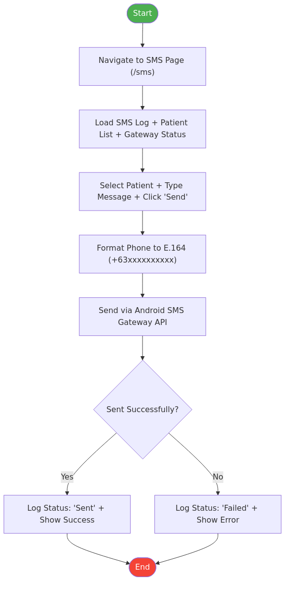

---

## 7. Application Prototype

This section shows the application's prototype screens. These served as a reference for the final design of the product.

### 7.1 Login Page

The login page provides authentication with email, password, and role selection (Admin or Patient). The system validates credentials and routes users to the appropriate dashboard based on their role.

**Key Elements:**
- Email input field
- Password input field
- Role selection (Admin / Patient)
- "Remember Me" checkbox
- Login button with CSRF protection

### 7.2 Admin Dashboard Page

The admin dashboard displays key performance indicators (KPIs) including total registered mothers, total children, today's scheduled vaccinations, and unread messages. It also shows a list of upcoming vaccinations.

**Key Elements:**
- KPI Cards: Total Mothers, Total Children, Today's Vaccinations, Unread Messages
- Upcoming Vaccinations list with patient names and scheduled dates
- Quick navigation to all system modules

### 7.3 Patient Records Table Page

The patient records page displays all registered patients in a searchable, filterable data table with KPI summary cards.

**Key Elements:**
- Search bar (by name or phone number)
- Filter by Type (All Types / Maternal / Child)
- Filter by Status (All Status / Active / Due for Visit / High Risk / Completed)
- KPI Cards: Total Patients, Maternal Cases, Child Records, Due for Visit
- Patient data table with name, type, status, and actions

### 7.4 Patient Registration Form

The registration form captures patient demographics, emergency contacts, and health-specific information based on the selected registration type.

**Key Elements:**
- Personal Information: Name, Date of Birth, Gender, Phone, Email, Address
- Emergency Contact: Name and Phone
- Registration Type Toggle: Maternal or Child
- Conditional Fields:
  - Maternal: LMP, Gravida, Para, PhilHealth Number, Medical History
  - Child: Birth Weight, Birth Height

### 7.5 Maternal Health Monitoring Page

The maternal health monitoring page displays the patient's prenatal profile, checkup visit history, and a form to log new checkup visits.

**Key Elements:**
- Patient Profile Card (Name, Age, LMP, EDD, Gravida/Para)
- Checkup Visit History Table (Visit #, Date, Weight, BP, FHR, Status, Notes)
- New Checkup Visit Form (Weight, Blood Pressure, Fetal Heart Rate, Notes)

### 7.6 Immunization Tracking Page

The immunization tracking page displays the child's complete EPI vaccination schedule with status indicators and action buttons for marking doses as administered.

**Key Elements:**
- Child Profile Card (Name, Age, Birth Weight/Height)
- Vaccine Schedule Table (Vaccine, Dose #, Scheduled Date, Status, Given Date, Administered By)
- Action Button: Mark as "Given" (Admin only)
- Status Badges: Scheduled / Given

### 7.7 Growth Monitoring Page

The growth monitoring page tracks a child's weight and height over time with age-in-months calculations.

**Key Elements:**
- Growth Measurements Table (Date, Age in Months, Weight, Height, Status)
- New Measurement Form (Weight in kg, Height in cm)
- Auto-calculated age in months from date of birth

### 7.8 SMS Management Page

The SMS management page provides gateway configuration, connection testing, manual message sending, and a log of all sent messages.

**Key Elements:**
- Gateway Configuration Form (URL, Username, Password)
- Connection Status Indicator (Online / Offline)
- Test Connection Button
- Send SMS Form (Select Patient, Type Message)
- SMS History Log Table (Patient, Phone, Message, Status, Sent At)

### 7.9 Messaging Page

The messaging page provides real-time chat functionality between healthcare workers and patients.

**Key Elements:**
- Patient List Sidebar (Admin view) with unread indicators
- Chat Window with message bubbles (sent/received)
- Message Input with file attachment support (up to 20MB)
- Read Receipt Indicators
- Real-time updates via WebSocket (Laravel Reverb)

### 7.10 Reports Page

The reports page provides analytical dashboards with charts and statistics.

**Key Elements:**
- Total Patients by Type (Maternal / Child)
- Monthly Registration Trends Chart (Bar Chart, Jan–Dec)
- Immunization Compliance Rate (Percentage of administered vs scheduled doses)

### 7.11 Patient Portal Page

The patient portal is the landing page for patient (mother/guardian) users, providing a summary dashboard with access to their health records.

**Key Elements:**
- Welcome Card with patient name
- KPI Cards: Number of Children, Next Vaccine Due, Overdue Vaccines, Unread Messages
- Quick Links: View Maternal Records, View Immunization Schedule, View Growth Chart, Open Chat

### 7.12 Admin User Management Page

The admin user management page allows administrators to manage system user accounts.

**Key Elements:**
- User List Table (Name, Email, Role, Status)
- Create New User Button
- Edit / Disable User Actions

---

## 8. Technology Stack Summary

| Layer | Technology | Version |
|---|---|---|
| **Backend Framework** | Laravel | 13.x |
| **Programming Language** | PHP | 8.4 |
| **Frontend Templating** | Blade | (Laravel built-in) |
| **CSS Framework** | Tailwind CSS | v4 |
| **Build Tool** | Vite | Latest |
| **Database (Production)** | MySQL | 8.0 |
| **Database (Development)** | MySQL via XAMPP/Laragon | 8.0 |
| **WebSocket Server** | Laravel Reverb | (Laravel built-in) |
| **Local Server** | XAMPP or Laragon | Apache + MySQL + PHP |
| **PWA** | Service Worker + IndexedDB | HTML5 Standard |
| **SMS Gateway** | Capcom6 Android SMS Gateway | Open Source |
| **Authentication** | Laravel Sanctum | (Laravel built-in) |
| **Charts** | Chart.js | Latest |
| **PDF Generation** | Dompdf | Latest |

---

## 9. Deployment and Infrastructure

### Local Development Server

| Service | Port | Description |
|---|---|---|
| **Laravel App** | `localhost:8000` | Main web application (`php artisan serve`) |
| **Reverb WebSocket** | `localhost:8080` | Real-time messaging server (`php artisan reverb:start`) |
| **MySQL** | `3306` | Database server (via XAMPP/Laragon) |
| **phpMyAdmin** | `localhost/phpmyadmin` | Database management interface (via XAMPP) |

### Environment Configuration

Key environment variables required for deployment:

```env
# Application
APP_NAME="Maternal Health Hub"
APP_URL=http://localhost:8000

# Database
DB_CONNECTION=mysql
DB_HOST=127.0.0.1
DB_PORT=3306
DB_DATABASE=healthcare_db
DB_USERNAME=root
DB_PASSWORD=

# SMS Gateway
SMS_GATEWAY_URL=http://<device-ip>:<port>
SMS_GATEWAY_USER=your_generated_username
SMS_GATEWAY_PASSWORD=your_generated_password

# WebSocket (Laravel Reverb)
REVERB_APP_ID=...
REVERB_APP_KEY=...
REVERB_APP_SECRET=...
REVERB_HOST=127.0.0.1
REVERB_PORT=8080
BROADCAST_CONNECTION=reverb
```

### Branch Strategy

| Branch | Purpose |
|---|---|
| `main` | Production (protected) |
| `dev` | Staging / Integration |
| `feature/*` | Feature branches, merged into `dev` |

### Public Access

For exposing the local development environment to the public internet securely (for testing on mobile devices or sharing with stakeholders), Cloudflare Quick Tunnel is used:

```bash
cloudflared tunnel --url http://localhost:8000
```

This generates a temporary `*.trycloudflare.com` URL that points to the local application.

---

**Document Prepared By:** Software Development Team  
**Project:** Maternal and Child Health Monitoring System  
**Location:** Barangay Bicao Health Center, Carmen, Bohol  
**Framework Reference:** TrackERB Software Documentation Format
