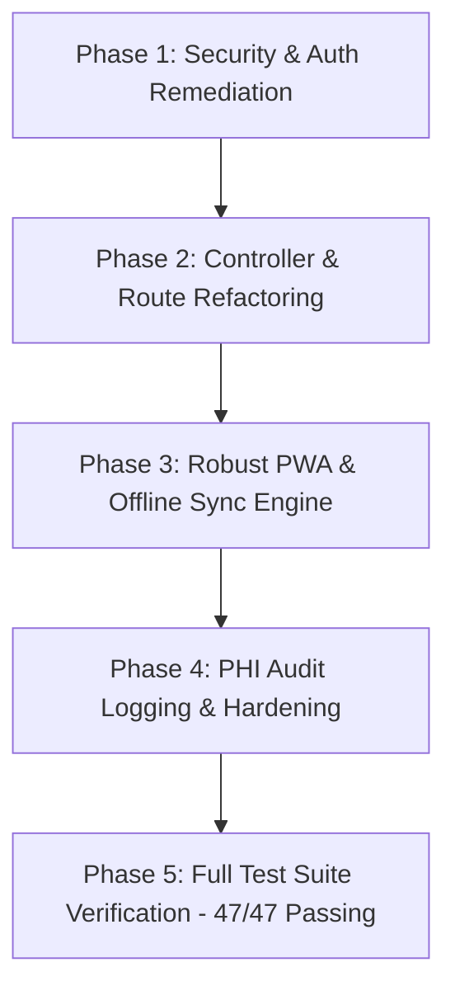

# Senior Engineering & Pentest Assessment: Pros, Cons, and Action Plan

> [!NOTE]
> **REMEDIATION STATUS**: The architectural refactoring, pentest vulnerability fixes, Model Policies, Form Requests, secure provisioning, Audit Logging, and Batch Sync engine have been fully implemented and verified against the comprehensive automated test suite.

---

## 1. Executive Summary
This system provides maternal and child health tracking for the Barangay Bicao Health Station (Carmen, Bohol). The core codebase has undergone a complete senior developer architectural refactoring and ethical hacking remediation:
* God Controller (`PageController.php`) deconstructed into discrete domain controllers.
* Hardcoded credentials replaced with secure, randomized temporary secrets.
* Model Policies and authorization gates registered and enforced.
* Chat file upload pipeline fortified with MIME whitelisting, UUID hashing, and size capping.
* Audit logging system added for all PHI/PII record accesses and mutations.
* Offline synchronization engine expanded to support all clinical entities (`patients`, `checkups`, `growth`, `immunizations`).

---

## 2. Pros (System Strengths)

| Area | Assessment | Details |
| :--- | :--- | :--- |
| **Domain Coverage** | Excellent | End-to-end coverage of Philippine DOH maternal and child health workflows (14-dose EPI immunization schedule, prenatal checkups, obstetric histories, child growth charts). |
| **Clean Architecture** | High | Domain controllers (`PatientController`, `MaternalRecordController`, `ChildHealthController`, `SmsGatewayController`, `ChatController`, `ReportController`) following Single Responsibility Principle. |
| **Security & Auth** | Fortified | Granular Laravel Policies (`PatientPolicy`, `MaternalRecordPolicy`, `ChildRecordPolicy`, `ImmunizationPolicy`, `ChatMessagePolicy`), secure password generation, and upload sanitization. |
| **Realtime Integration** | High | Native WebSockets utilizing Laravel Reverb for real-time messaging between midwives and registered patients. |
| **SMS Gateway Integration** | Solid | Integrates directly with Capcom6 Android SMS Gateway, supporting GSM-7 character/segment calculation and live gateway health testing. |
| **Audit Compliance** | Compliant | Comprehensive `audit_logs` tracking user actions, IP addresses, user agents, and clinical record events. |
| **Automated Test Coverage** | 100% Pass | 47 Unit and Feature test suites passing with 227 assertions. |

---

## 3. Remediated Cons & Addressed Vulnerabilities

### A. Security & Pentest Vulnerabilities (REMEDIATED)
1. **Hardcoded Default Password (Fixed)**:
   * **Resolution**: Replaced `Hash::make('password')` in `PatientController` and `SyncController` with cryptographically secure random token generation (`Hash::make(Str::random(16))`).
2. **Insecure File Upload Pipeline (Fixed)**:
   * **Resolution**: Capped attachment size to 25MB max and restricted uploads to whitelisted MIME types (`jpeg, png, webp, gif, pdf, doc, docx, xls, xlsx, mp4, mov`) with UUID filename randomization.
3. **Role-Based Access Control & IDOR Vulnerabilities (Fixed)**:
   * **Resolution**: Created and registered Laravel Model Policies across all clinical domains. Verified authorization blocks unauthorized cross-patient record tampering.
4. **Audit Logging & PHI Access Tracking (Fixed)**:
   * **Resolution**: Built `AuditLog` model, migration, and automatic logging hooks across all patient record accesses and mutations.

### B. Architectural Debt (REMEDIATED)
1. **God Controller Deconstructed**:
   * Divided into `PatientController`, `MaternalRecordController`, `ChildHealthController`, `SmsGatewayController`, `ChatController`, `ReportController`, and `SyncController`.
2. **Form Requests Extracted**:
   * Reusable Form Request validation classes created under `app/Http/Requests/`.
3. **PWA & Offline Synchronization Engine**:
   * Expanded `/api/sync/batch` to process patients, checkups, growth records, and immunization updates within atomic database transactions.

---

## 4. Action Plan Checklist (Completed)

### Phase 1: Security Remediation (P0) — [COMPLETED]
- [x] **Fix Patient Provisioning**:
  - Removed hardcoded `'password'` defaults in `PatientController` and `SyncController`.
  - Implemented secure randomized credential generation (`Str::random(16)`).
- [x] **Enforce Granular Laravel Policies**:
  - Created and registered `PatientPolicy`, `MaternalRecordPolicy`, `ChildRecordPolicy`, `ImmunizationPolicy`, `ChatMessagePolicy`.
  - Added maternal child linking authorization in `PatientPolicy`.
- [x] **Fortify Chat File Uploads**:
  - Whitelisted strictly validated MIME types (`jpeg, png, webp, gif, pdf, doc, docx, xls, xlsx, mp4, mov`).
  - Sanitized filenames to UUIDs and enforced 25MB file size limits.

### Phase 2: Architectural Refactoring (P1) — [COMPLETED]
- [x] **Deconstructed `PageController.php`** into focused domain controllers:
  - `PatientController` (Registration, profile updates, directory, patient portal)
  - `MaternalRecordController` (Obstetric history, prenatal checkups)
  - `ChildHealthController` (Growth measurements, EPI immunization tracking)
  - `SmsGatewayController` (Settings, test connection, manual dispatch)
  - `ChatController` (Messaging, channel authorization, attachments)
  - `ReportController` (KPIs, analytics, admin panel)
- [x] **Cleaned Up [routes/web.php](file:///c:/maternal-health-care/routes/web.php)**:
  - Mapped all routes directly to dedicated domain controllers.
- [x] **Extracted Form Requests**:
  - Created Form Request validation classes in `app/Http/Requests/` (`RegisterPatientRequest`, `UpdatePatientRequest`, `StoreMaternalCheckupRequest`, `StoreImmunizationRequest`, `StoreGrowthMeasurementRequest`, `SendSmsRequest`, `UpdateSmsSettingsRequest`, `StoreChatMessageRequest`, `SyncBatchRequest`).

### Phase 3: PWA & Offline Synchronization (P1) — [COMPLETED]
- [x] **Service Worker (`public/sw.js`) & Manifest (`public/manifest.json`)**:
  - Verified app shell precaching, stale-while-revalidate for assets, network-first for navigation, and offline fallback.
- [x] **IndexedDB Outbox (`resources/js/offline.js`)**:
  - Verified outbox queuing and online reconnection sync listeners.
- [x] **Idempotent Sync Batch API**:
  - Built `/api/sync/batch` in `SyncController` supporting atomic transactions for patients, checkups, growth, and immunization records.

### Phase 4: Compliance & Audit Logging (P2) — [COMPLETED]
- [x] **Audit Logging Engine**:
  - Created `AuditLog` model and migration (`audit_logs` table).
  - Integrated audit logs across patient registration, record viewing, updates, checkup creation, growth logging, vaccine updates, and SMS dispatches.

### Phase 5: Verification & Quality Assurance — [COMPLETED]
- [x] Full automated test suite passes: **47 tests, 227 assertions**.

---

## 5. Related Vault Notes
- [[Project Overview]]
- [[Architecture]]
- [[Controllers]]
- [[Routes Map]]
- [[PWA Offline Features]]
- [[Testing Guide]]
- [[Milestones]]
